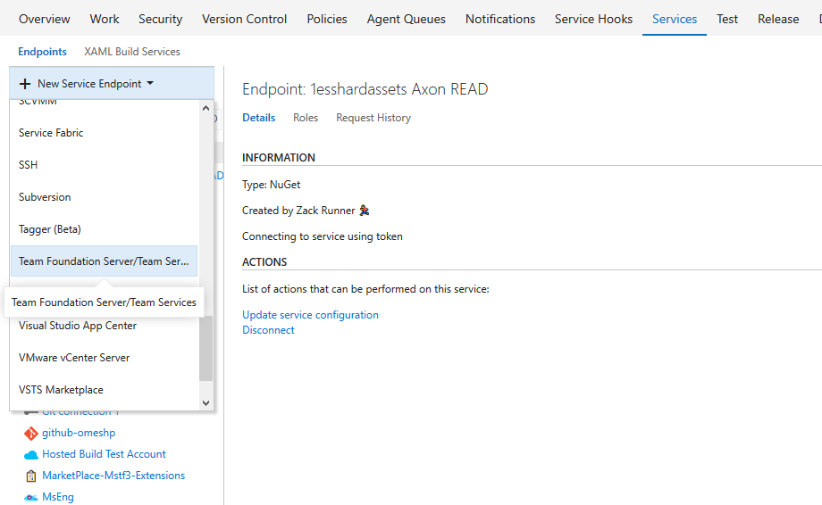
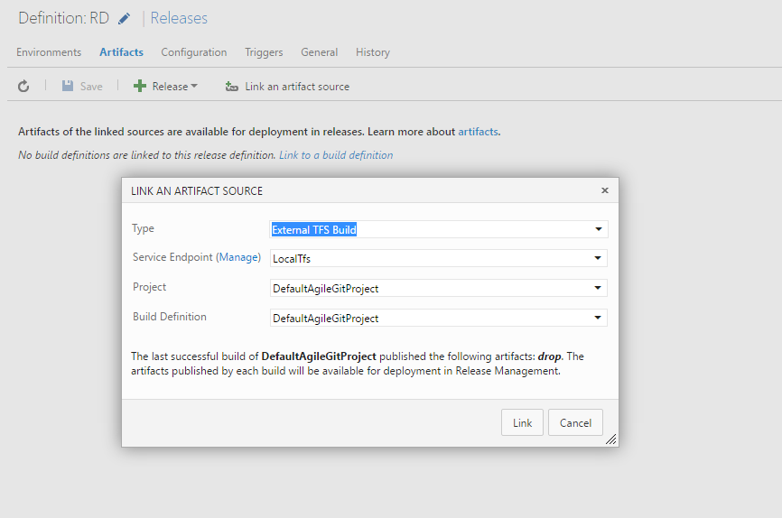

# TFS artifacts for Release Management

With this extension, you can deploy artifacts from external TFS or Azure Devops. The artifacts could be any of the following from Azure Devops or TFS:
1. Build
2. Xaml Build
3. Git
4. Team Foundation Version Control 

These Build/Code artifacts could be from different TFS or VS Azure Devops accounts or from different collections from the same account.

**Note:** This extension work only with Azure Devops and TFS "17" U2 onwards. 

## Usage
This extension provides a service endpoint to connect to an external TFS or Azure Devops Collection. Once connected, you can link an artifact from this TFS / Azure Devops.

### Connecting to an External TFS/Azure Devops account & collection
When using Basic Authentication scheme, enable [Basic Auth on TFS](https://github.com/Microsoft/tfs-cli/blob/master/docs/configureBasicAuth.md)

**Note:** You would need to provide the URL to an external account with 'Collection' name in the URL. E.g. https://fabfiber.visualstudio.com/DefaultCollection

### Linking an external artifact (Build in this example)
Once you have set up the service endpoint connection, you would be able to link an external TFS/Azure Devops build artifact in your release definition

### Known Issues

**1. Code artifacts (External TFS version control and External TFS GIT) does not work with PAT based External on-prem TFS service endpoints.** 
Release linked to External TFS Version Control will fail with below error message at download artifact step:
TF30063: You are not authorized to access http://{ExternalTfsServerName}:{port}/tfs/DefaultCollection.
 
Release linked to External TFS GIT will fail with below error message at download artifact step:
Authentication failed for 'http://.:********@{ExternalTfsServerName}:{port}/tfs/DefaultCollection/_git/{GitProjectName}/

**Note:** Code artifacts (External TFS version control and TFS GIT) works fine with PAT based VSTS service endpoints.

**2. "External TFS version control" code artifact download fails when agent is running as Network Service.**
Release linked to External TFS Version Control will fail with below error message at download artifact step:
TF30063: You are not authorized to access http://fabfiber.visualstudio.com/DefaultCollection

Workaround - Run agent as admin user(either interactively or as service) when working with "External TFS version control" code artifact.

### FAQs

**1. Can I use an external TFS build artifact that is not accessible from my Azure Devops account?**

Yes you can. However, the agent that deploys the external TFS Build artifact needs to have access to the linked artifact (External TFS build artifact).

**2 Can I use a build from another collection of my current TFS?**

Yes. To do this, you would need to add a service endpoint connection to required collection. Once done, you could link an artifact from this collection as an external TFS/Azure Devops artifact.

**3. Can I link Xaml Build from my external TFS account?**

Yes.

**4. Can I link to a Build from TFS 2012?**

No. This extension supports TFS 2013 and above versions.

**5. I am getting the error "Missing contribution (ms.vss-releaseartifact.artifact-types)" with TFS 2015 update 3 on-prem?**

The extension isn't supported for TFS 2015 update 3, It is only supported TFS "15" RC onwards.

**6. I am not able to see the ExternalTfs types in link artifacts UI with TFS 2015 update 2?** 

The extension isn't supported for TFS 2015 update 2, It is only supported TFS "15" RC onwards.

**7. Where can I learn more about artifacts in Release Management?**

You can refer to Release Management [documentation](https://msdn.microsoft.com/library/vs/alm/release/author-release-definition/understanding-artifacts) for more details. Also you can use [Azure Pipelines Extensions on Github](https://github.com/Microsoft/azure-pipelines-extensions/issues) to report any issues.
