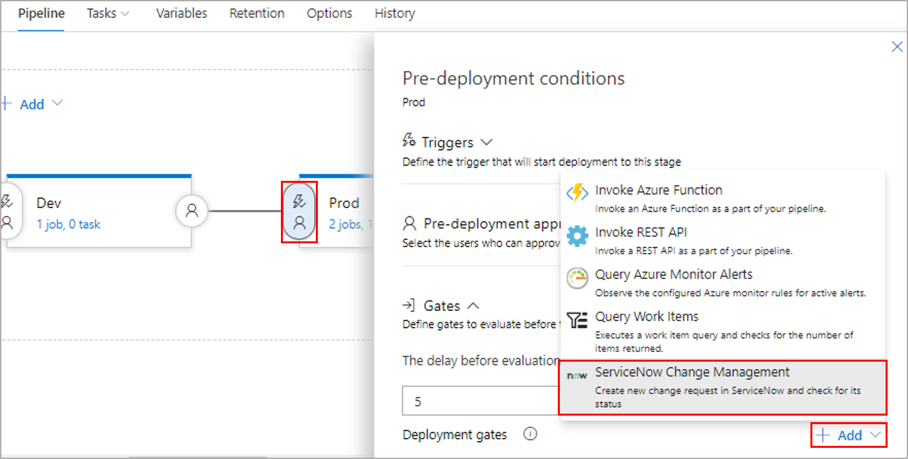
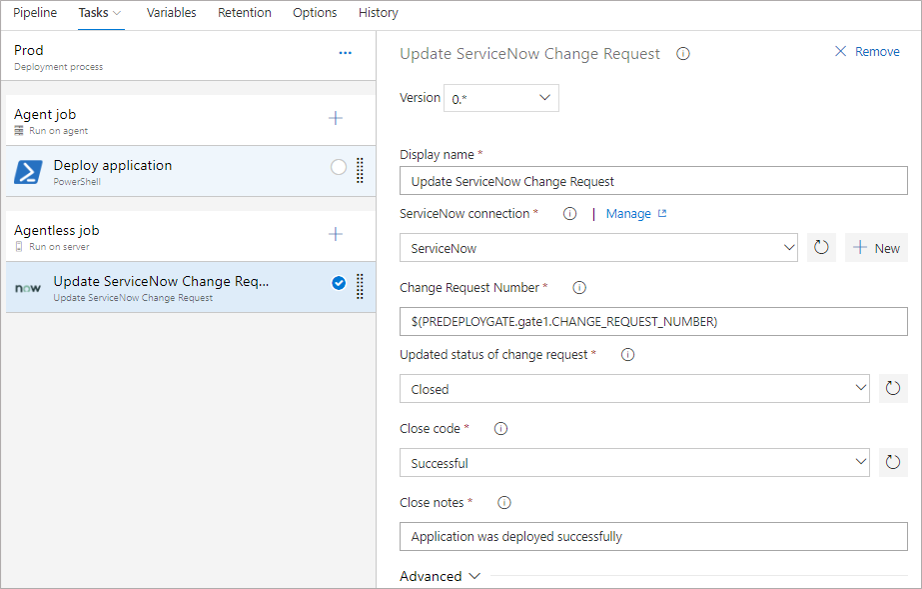

# ServiceNow Change Management Extension

ServiceNow is a software-as-a-service (SaaS) provider of IT service management (ITSM) software, including change management.
Specific change management subprocesses include change risk assessment, change scheduling, change approvals and oversight. 
With change management, your organization can reduce the risks associated with change, while speeding up the deployments with Azure Pipelines. 

This extension enables integration of ServiceNow Change Management with Azure Pipelines.                                                 
It includes 
- A [release gate](https://docs.microsoft.com/en-us/azure/devops/pipelines/release/approvals/gates?view=vsts) to hold the pipeline till the change management process signals implementation for a change request. You can create a new change request for every deployment or use an existing change request.                     
- An agentless task to update a change request during the deployment process. It is typically used as the last task in the stage.

The deployment process in Azure Pipelines helps automate the deployment and complement the controls offered by ServiceNow.

## Usage
#### Integration requires the [Azure Pipelines](https://store.servicenow.com/sn_appstore_store.do#!/store/application/fa788cb5dbb5630040669c27db961940) application to be installed on the ServiceNow instance.   
   
A service account (user) must be created in ServiceNow and granted the `x_mioms_azpipeline.pipelinesExecution` role. This user would be used for all the communication.

#### Create service connection for ServiceNow in Azure Pipelines. Provide username and password for the service account configured previously.

Use **Verify connection** before using it in the gate or task. 
You must have a compatible Azure Pipelines application installed on the ServiceNow instance. 
It is recommended to use the latest version application and gate/task. 

#### Configure a release gate for ServiceNow Change Management.

**Gate** can be configured to **create a new change request** for every run of the pipeline or **use an existing request**.
Inputs provided in the gate are used as properties for the new change request in ServiceNow, if applicable.

 **Inputs for Gate**:
- **ServiceNow connection**: Connection to the ServiceNow instance used for change management.
- **Action**: Gate on status of new change request or an existing change request.
- **Change type**: Type of the change request.
- **Standard change template**: Change template name for the change request.
- **Short description**: A summary of the change.
- **Change query criteria**: Criteria for querying change request. Must uniquely identify the change request. Gate would fail if multiple matching change requests are found.
- **query string/ change request number**: Change request to use.

Additional properties can be set in the created change request using the following inputs. Note: Available inputs change based on the selected change type. 

- **Description**: A detailed description of the change.
- **Category**:  The category of the change eg. Hardware, Network, Software.
- **Priority**: Priority of the change.
- **Risk**: The risk level for the change.
- **Impact**: The effect that the change has on business.
- **Configuration Item**: Configuration item (CI) that the change applies to.
- **Assignment group**:  The group that the change is assigned to.
- **Schedule of change request**: Schedule of the change as honored by the ServiceNow workflow.                                                                                                                 Date and time should be in UTC and format should be `yyyy-MM-ddTHH:mm:ssZ. eg. 2018-01-31T07:56:59Z.`
- **Additional change request parameters**:  Additional properties of the change request to set.                                                                                      Name must be field name (not label) prefixed with 'u_' `eg. u_backout_plan`.                                                            Value must be a valid, accepted value in ServiceNow. Invalid entries are ignored.

**Gate Success Criteria** :
- **Desired state**: The gate would succeed and the pipeline continues when the change request status is same as the provided value.

**Gate Output Variables** :                                                                                                             
ServiceNow gate produces output variables.                                                                                               You must specify reference name to be able to use these output variables in the deployment workflow. Gate variables can be accessed by using `"PREDEPLOYGATE"` as a `prefix`. For eg. when reference name is set to 'gate1', then the change number can be obtained as `$(PREDEPLOYGATE.gate1.CHANGE_REQUEST_NUMBER)`.

- **CHANGE_REQUEST_NUMBER** : Number of the change request.
- **CHANGE_SYSTEM_ID** : Sys Id of the change request.

#### Add a task to update the change request

**Inputs for Update change request task**:
- **ServiceNow connection**: Connection to the ServiceNow instance used for change management.
- **Change request number**: Number of the change request to update.
- **Update status**: Select this option to update status of the change request.
- **Updated status of change request** : Status to set for the change request. This input is available if `Update status` is selected.
- **Close code and notes**: Closure information for the change request.
- **Work notes**: Work notes for the change request,
- **Additional change request parameters**:  Additional properties of the change request to set.

## Steps to add mapping for custom fields in Import set transform map :

##### In order to insert custom fields for a change request (using additional change request parameters), please add mapping of the custom fields in import set transform map by following below steps:

**Adding custom fields in import set table**:                                      
**Login** to your ServiceNow instance and open link : `https://<Instance-name>.service-now.com/v_ws_editor.do?sysparm_query=name=x_mioms_azpipeline_change_request_import`

1.	Select '**Copy fields from target table**' 
2.	Select **Target table** 'Change Request [**change_request**] from drop down.
3.	Click on '**Update**' 

**Add mapping in Transform map**

1. Navigate to **System Import Sets > Transform Maps**.
2. Open the Transform Map named '**change_request_imports**'

1. In the Field Maps related list, **Click New**.
2. Select the **Source field** (your custom field).
3. Select the **Target field**
4. Click **Submit**

Click **Update**

Field mapping **added**

