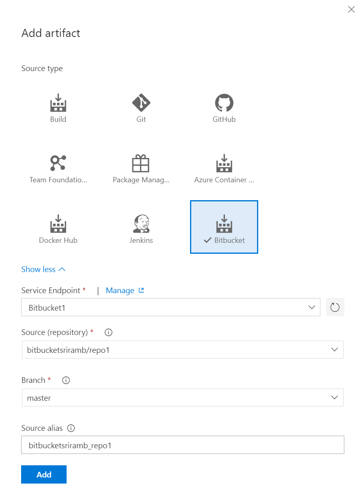
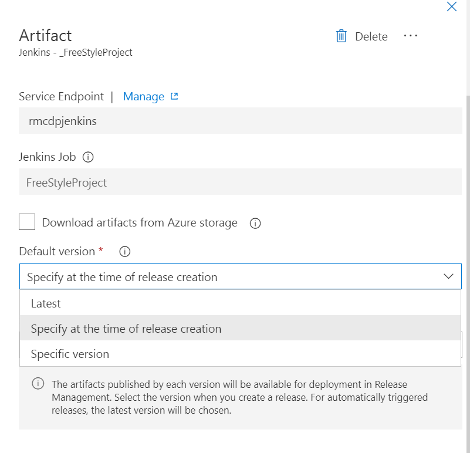
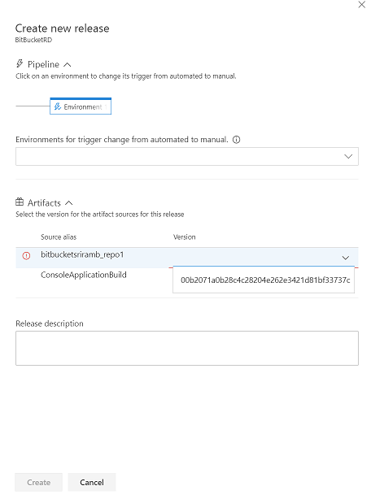
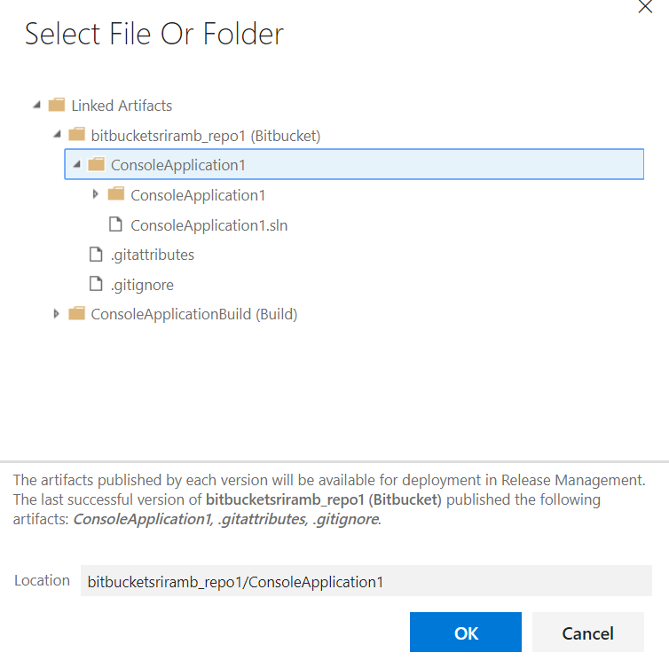
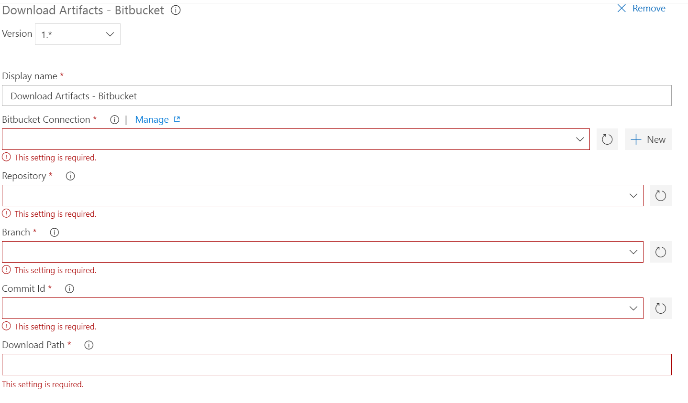
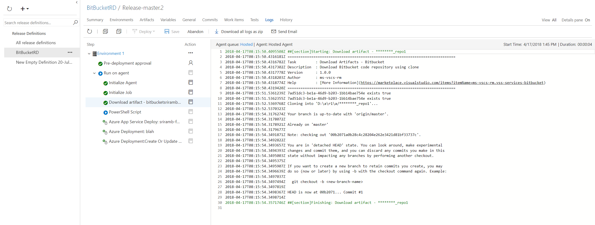
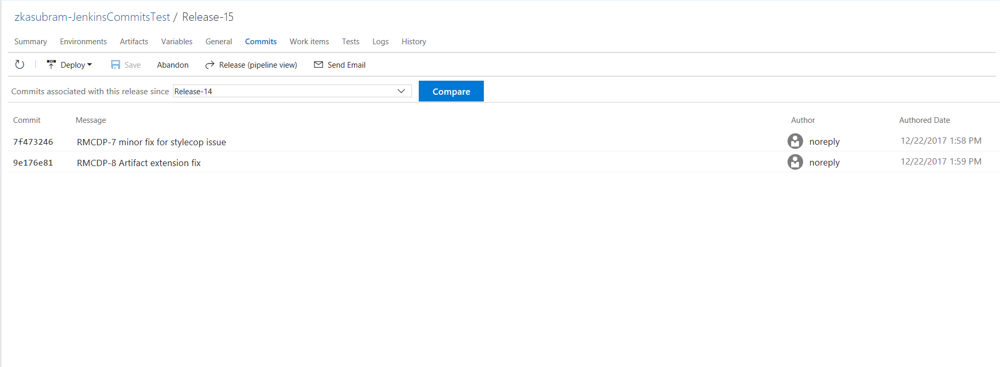
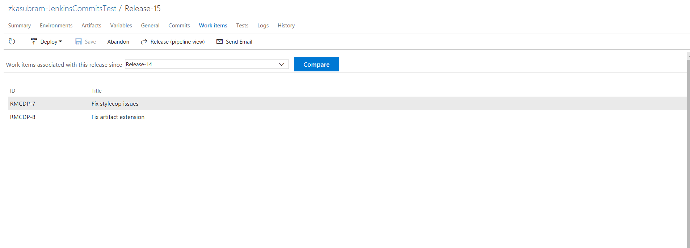

# Custom Release Artifact Source

## Overview
*VSTS RM* supports deploying artifacts corresponding to artifact sources as part of release.
To clarify terminology: *VSTS Build* definition can be linked as artifact source within *VSTS Release* definition. When a Release is created out of the Release Definition, a specific Build gets deployed across one or more environments. The Build used in the Release is referred to as artifact.

VSTS RM supports a bunch of inbuilt artifact source types – *VSTS Build Definitions*, *VSTS Git Repos*, *VSTS VC Repos (a.k.a. TFVC Repos)*, *VSTS Package Management Packages*. 
VSTS RM also supports linking non-VSTS artifact sources also within VSTS Release Definition. For e.g. *Jenkins Jobs, TeamCity Build Configurations, BitBucket Repos, Docker Hub Images, Azure Container Registry Images* etc.

In order to support linking non-VSTS artifact sources, VSTS RM supports an extensibility model. 

This document attempts to describe the model and provides references to existing custom artifact sources.

## Artifact Source Integration points
Custom artifact source can plug-in to a bunch of existing integration points for artifact source within VSTS RM to provide a first-class user experience and seamless integration.
Before getting into details of the extensibility model, it would be good to understand the various integration points that exists within VSTS RM for custom artifact sources.

Artifact source integration points in RM :
- [Link artifact](#linkartifact)
- [Create release](#createrelease)
- [Browse artifact](#browseartifact)
- [Download artifact task](#downloadtask)
- [Release artifact variables](#releasevariables)
- [Artifact URLs](#artifacturls)
- [Query release definitions for an artifact source](#queryreleases)
- [Query commits & work items between releases](#querycommits)

### <a name="linkartifact"></a> Linking artifact source
VSTS RM recognizes artifact source types that are available in the VSTS account and allows any of them to be chosen when linking artifact source within a release definition.
When linking an artifact source, the details for the artifact source can be provided through set of a drop-down controls. One of the values typically provided is the service endpoint used for interacting with the custom artifact source provider. The values in the other drop-downs are fetched from the artifact source provider using the service endpoint.

In the screen-shot below, *BitBucket* repo is linked to Release Definition. The inputs provided include *BitBucket* endpoint, repository & branch to use. 



Using the BitBucket endpoint provided, the repos in the BitBucket account and the branches in the repo are listed.

#### Specify default version
When linking artifact source with release definition, a default version for the artifact in the release can be specified. This value is used when a version needs to be specified in case of an auto-triggered release, where the auto-trigger could be due to schedule set on the release definition or another artifact that is associated with the release definition.

For e.g. these are the possible values for default version in case of Jenkins artifact:



### <a name="createrelease"></a> Specify artifact version when creating release
The commit from the BitBucket repo to be used for the release can be specified through drop-down when creating release.


 
### <a name="browseartifact"></a> Browse artifact
In order to specify a file path location in task input, the BitBucket repo linked as artifact source with the release definition can be browsed.



### <a name="downloadtask"></a> Download artifact task
In order to download the artifact on the agent where deployment is executing, VSTS Release can utilize a download artifact task specific to the artifact source type. 
For e.g. here’s the “Download artifacts” task for *BitBucket*:



VSTS Release will automatically add the task as the first one within the job containing all the tasks within a phase sent to agent. VSTS Release fills in the values for the task inputs based on the values provided within the artifact source in the release definition & artifact version within the release.

For e.g. below is a capture of release logs view for a deployment containing BitBucket artifact. Notice the “Download artifact” task showing up in the logs although the task was not added to deployment phase in Environment 1.



### <a name="releasevariables"></a> Release artifact variables
The artifact source `definition` & artifact `version` information is passed down to tasks as release artifact variables. The following variables are made available for any custom artifact in the release :
```
Release.Artifacts.{alias}.DefinitionId
Release.Artifacts.{alias}.DefinitionName
Release.Artifacts.{alias}.BuildNumber
Release.Artifacts.{alias}.BuildId
Release.Artifacts.{alias}.Type
```

For e.g. below are the release artifact variables for the Bitbucket repo artifact
```
[RELEASE_ARTIFACTS_BITBUCKETSRIRAMB_REPO1_BUILDID] --> [00b2071a0b28c4c28204e262e3421d81bf33737c]
[RELEASE_ARTIFACTS_BITBUCKETSRIRAMB_REPO1_BUILDNUMBER] --> [00b2071a0b28c4c28204e262e3421d81bf33737c]
[RELEASE_ARTIFACTS_BITBUCKETSRIRAMB_REPO1_DEFINITIONNAME] --> [bitbucketsriramb/repo1]
[RELEASE_ARTIFACTS_BITBUCKETSRIRAMB_REPO1_DEFINTIONID] --> [bitbucketsriramb/repo1]
[RELEASE_ARTIFACTS_BITBUCKETSRIRAMB_REPO1_TYPE] --> [Bitbucket]
```

### <a name="artifacturls"></a> Artifact URLs
Artifact details within release can include the URLs for the artifact source definition & artifact version in order to allow customers to navigate to them from within the Release UI.
For e.g. here’s how the URLs for the Jenkins job and instance are made available within a release:
 
### <a name="queryreleases"></a> Query release definitions for an artifact source
This can be achieved by calling [Definitions](https://docs.microsoft.com/en-us/rest/api/vsts/release/definitions/list) – List REST API and passing the appropriate `artifactSourceId` parameter. Artifact source Id value corresponds to the value of the `uniqueSourceIdentifer` for the artifact type.

For e.g. in case of BitBucket artifact type, a value `artifactSourceId` can be :

`7ad51dc3-be1a-46d9-b203-1bb14bae754e:bitbucketsriramb/repo1:master`

### <a name="querycommits"></a> Query commits & work items between releases
VSTS RM supports viewing commits and work items associated with the artifact version for a custom artifact type used between two releases.

[Here](https://github.com/Microsoft/vsts-tasks/blob/984a93f74ce86a706c68a364b826f654de403906/Tasks/JenkinsDownloadArtifacts/jenkinsdownloadartifacts.ts#L202) is the logic that fetches commits & work items associated with Jenkins artifact for DownloadJenkinsArtifacts task.

Below is how the commits/work items associated with Jenkins artifact between two releases is seen within VSTS RM UI:





## Artifact Source contribution
In order to describe the salient properties within artifact source contribution, we will use [*BitBucket*](https://github.com/Microsoft/vsts-rm-extensions/blob/master/Extensions/BitBucket/Src/vss-extension.json) artifact source contribution as an example :
```
    {
      "id": "bitbucket-release-artifact-type",
      "description": "Bitbucket Artifact",
      "type": "ms.vss-releaseartifact.release-artifact-type",
      "targets": [ "ms.vss-releaseartifact.artifact-types" ],
      "properties": {
        "name": "Bitbucket",
        "displayName": "Bitbucket",
        "_displayName.comment": "Don't Localize the word 'Bitbucket'",
        "endpointTypeId": "bitbucket:UsernamePassword",
        "uniqueSourceIdentifier": "{{connection}}:{{definition}}:{{branch}}",
        "downloadTaskId": "A4CD16BE-6028-4077-8015-34F008F55477",
        "artifactType": "SourceControl",
        "inputDescriptors": [
          {
            "id": "connection",
            "name": "Service Endpoint",
            "description": "Service Endpoint Id",
            "inputMode": "Combo",
            "isConfidential": false,
            "hasDynamicValueInformation": true,
            "validation": {
              "isRequired": true,
              "dataType": "string",
              "maxLength": 300
            }
          },
          {
            "id": "definition",
            "name": "Source (repository)",
            "description": "Repository to pull",
            "inputMode": "Combo",
            "isConfidential": false,
            "hasDynamicValueInformation": true,
            "dependencyInputIds": [
              "connection"
            ],
            "validation": {
              "isRequired": true,
              "dataType": "string",
              "maxLength": 300
            }
          },
          {
              "id": "branch",
              "name": "Branch",
              "description": "Branch to checkout",
              "inputMode": "Combo",
              "isConfidential": false,
              "hasDynamicValueInformation": true,
              "dependencyInputIds": [
                  "connection",
                  "definition"
              ],
              "validation": {
                  "isRequired": true,
                  "dataType": "string",
                  "maxLength": 300
              }
          }
        ],
        "dataSourceBindings": [
          {
            "target": "definition",
            "dataSourceName": "Repositories",
            "resultTemplate": "{ Value : \"{{{full_name}}}\", DisplayValue : \"{{{full_name}}}\" }"
          },
          {
            "target": "branch",
            "dataSourceName": "Branches",
            "resultTemplate": "{ Value : \"{{{name}}}\", DisplayValue : \"{{{name}}}\" }"
          },
          {
            "target": "versions",
            "dataSourceName": "Commits",
            "resultTemplate": "{ Value : \"{{hash}}\", DisplayValue : \"{{{hash}}}\" }"
          },
          {
            "target": "latestversion",
            "dataSourceName": "LatestCommit",
            "resultTemplate": "{ Value : \"{{hash}}\", DisplayValue : \"{{{hash}}}\" }"
          },
          {
            "target": "artifacts",
            "endpointUrl": "{{{endpoint.url}}}/1.0/repositories/{{{definition}}}/src/{{{version}}}//",
            "resultTemplate": "[ {{#directories}} { \"value\" : \"{{{this}}}\",  \"displayValue\" : \"{{{this}}}\",  \"data\" : { \"artifactType\": \"folder\"  } }{{#unless @last}},{{/unless}} {{/directories}} {{#files}} , { \"value\" : \"{{this.path}}\",  \"displayValue\" : \"{{{this.path}}}\", \"data\" : { \"itemType\": \"file\" } } {{/files}} ]"
          },
          {
            "target": "artifactItems",
            "endpointUrl": "{{{endpoint.url}}}/1.0/repositories/{{{definition}}}/src/{{{version}}}/{{{itemPath}}}/",
            "resultTemplate": "[ {{#directories}} { \"value\" : \"{{{../itemPath}}}/{{{this}}}\",  \"displayValue\" : \"{{{../itemPath}}}/{{{this}}}\",  \"data\" : { \"itemType\": \"folder\" } }{{#unless @last}},{{/unless}} {{/directories}} {{#files}} , { \"value\" : \"{{this.path}}\",  \"displayValue\" : \"{{{this.path}}}\", \"data\" : { \"itemType\": \"file\" } } {{/files}} ]"
          }
        ],
        "browsableArtifactTypeMapping": {
          "folder": "artifactItems"
        }
      }
    }
```

## Salient properties

| Property      | Description |
| ------------- |:-------------|
| `name` | This represents the name of the artifact type and is used to identify the artifact type when linking artifact source. |
| `displayName` | This is used to show the name in UI. |
| `artifactType` | This identifies the [category](#artifactcategories) that the artifact type belongs to. |
| `endpointTypeId` | This is the type of endpoint that is associated with the artifact source type. When linking artifact source within release definition, VSTS RM UI will list only endpoints of this given type in the input for the endpoint. |
| `uniqueSourceIdentifer` | This is a mustache template that identifies the artifact source uniquely across other artifact sources associated with VSTS release definitions. For *BitBucket* artifact source type, the uniqueSourceIdentifier is `{{connection}}:{{definition}}:{{branch}}`, where the values for the variables in the mustache expression is fetched from the inputs. |
| `downloadTaskId` | This is used to associate the artifact type with the task used to download it as part of deployment. This is optional and need not be specified in case there is no need to download the artifact as part of deployment. |
| `inputDescriptors` | This is used to represent the various inputs for the artifact source when linking it within release definition. Some of these are the [well-known input descriptors](#wellknowninputdescriptors) that VSTS expects artifact source contribution to declare to be able to allow linking it within release definition & deploying it within a release. In addition to these inputs, the artifact source can include other inputs specific to the type. All the inputs specified when linking the artifact source will be passed as inputs to the Download Artifacts task. The input names in the artifact & task inputs have to match. |
| `dataSourceBindings` | This is used to represent the REST APIs in the artifact source provider that can be queried by *VSTS* and provide rich artifact integration points. *VSTS* recognizes a bunch of [well-known targets for data source bindings](#wellknowntargets) and leverages them to query and light up the integration points in UI where data needs to be fetched from artifact source provider. |
|||

### <a name="artifactcategories"></a>*Categories of artifact types* :
| Artifact type | Examples |
| ------------- |:-------------|
| `Build` | Jenkins, TeamCity, External TFS Build etc. |
| `SourceControl` | BitBucket, External TFS Git etc. |
| `Package` | VSTS Package Management etc. |
| `ContainerImage` | DockerHub, Azure Container Registry etc. |

### <a name="wellknowninputdescriptors"></a> Well-known input descriptors :
| Input Name | Description | Required |
| ------------- |:-------------|:--------:|
| `connection` | Endpoint used to connect to the artifact source | `true` |
| `definition` | Artifact source definition (e.g. Build definition in case of *VSTS Build*, Repo in case of *TF Git/ GitHub*, Package in case of *VSTS Package Management*) | `true` |
| `defaultVersionType` | Default version type specified for the artifact source. It can be one of the [supported default version types](#defaultVersionTypes). In case this input is not specified, then the default value will be `selectDuringReleaseCreationType`. | `false`
| `defaultVersionSpecific` | Specific version in case `defaultVersionType` is `specificVersionType` | `false`
| `branch` | Branch input in case `defaultVersionType` is `latestFromBranchType` | `false`
| `artifacts` | First level contents from latest version of a specific artifact source (e.g. Artifacts in a *VSTS Build*, Root files/folders in case of *VSTS Git/GitHub* repo) | `false`
|||

### <a name="defaultVersionTypes"></a> Supported default version types :
| Default Version Type Value |  Description  |
| ------------- |:-------------:|
| `latestType`      | Latest artifact version |
| `selectDuringReleaseCreationType`      | Specify at the time or release creation ** |
| `specificVersionType` | Specific version of artifact is provided      |
| `latestFromBranchType` | Latest artifact version from a specific branch      |

** *In case of auto-triggered release, the latest version will be picked up.*

### <a name="wellknowntargets"></a> Well-known targets for data source bindings :
| Target | Description | Required |
| ------------- |:-------------|:---------:|
| `definition` | List the available artifact source definitions (e.g. *VSTS Build* Definitions, *VSTS Git/GitHub* Repos, *VSTS Package Management* Packages) | `true` |
| `versions` | List the available versions of a specific artifact source definition (e.g. Builds for a specific Build Definition in case of *VSTS Build*, Commits in a Repo in case of *VSTS Git/GitHub*, Package versions of a Package in case of *VSTS Package Management*) | `true` |
| `latestversion` | Fetch latest version of a specific artifact source | `true` |
| `branch` | List branches available in given artifact source (e.g. Branches in *VSTS Git/GitHub* repo, branches in repo corresponding to a *Jenkins* job) | `false` |
| `artifacts` | Fetch the first level contents from latest version of a specific artifact source (e.g. Artifacts in a Build, Root files/folders in case of TF Git/GitHub repo). `itemType` in `data` field should specify the type of item e.g `folder`, `file` e.t.c | only for browsing artifact |
| `artifactItems` | Fetch next level contents from latest version of a specific artifact source (e.g. Files/Folders within a specific Artifact in a *VSTS Build*, sub-folders/files under a given folder in case of *VSTS Git/GitHub* repo) | only for browsing artifact |
| `browsableArtifactTypeMapping`| Can be used to specify mapping from `itemType` to `dataSourceBinding` if artifact source produces multiple types of artifacts | `false` |
| `artifactSourceDefinitionUrl` | URL of specific artifact source (e.g. *VSTS Build* definition URL, *Jenkins* job URL) | `false` |
| `artifactSourceVersionUrl` | URL of specific artifact version (e.g. *VSTS Build* URL, *Jenkins* job instance URL) | `false` |
| `defaultVersionSpecific` | Fetch all versions of artifact corresponding to specific artifact source | `false` |
 
## References to custom artifact sources
A bunch of *VSTS Release* artifact sources are built out of [vsts-rm-extensions](https://github.com/Microsoft/vsts-rm-extensions/) *GitHub* repo.

- [*BitBucket*]( https://github.com/Microsoft/vsts-rm-extensions/tree/master/Extensions/BitBucket/Src)
- [*TeamCity*](https://github.com/Microsoft/vsts-rm-extensions/tree/master/Extensions/TeamCity/Src)
- [*ExternalTfs*](https://github.com/Microsoft/vsts-rm-extensions/tree/master/Extensions/ExternalTfs/Src)
- *Jenkins* artifact type is implemented as a built-in contribution. Jenkins download task implementation can be found [here](https://github.com/Microsoft/vsts-tasks/blob/master/Tasks/JenkinsDownloadArtifacts)
- *VSTS Package Management* artifact type is implemented as a built-in contribution. Package download task implementation can be found [here](https://github.com/Microsoft/vsts-tasks/tree/master/Tasks/DownloadPackage)